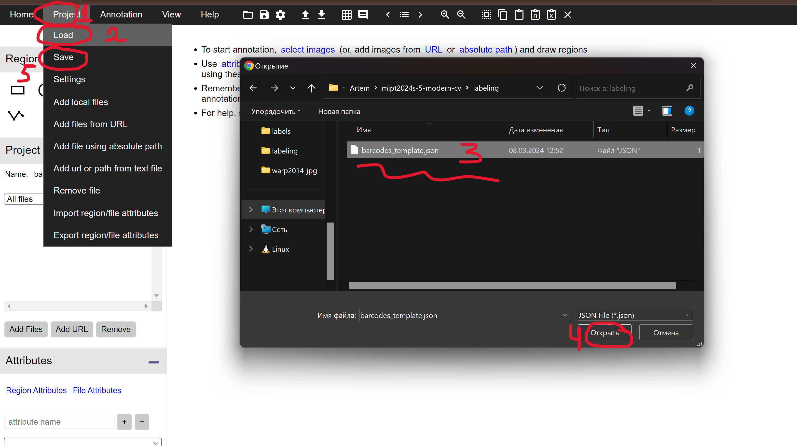
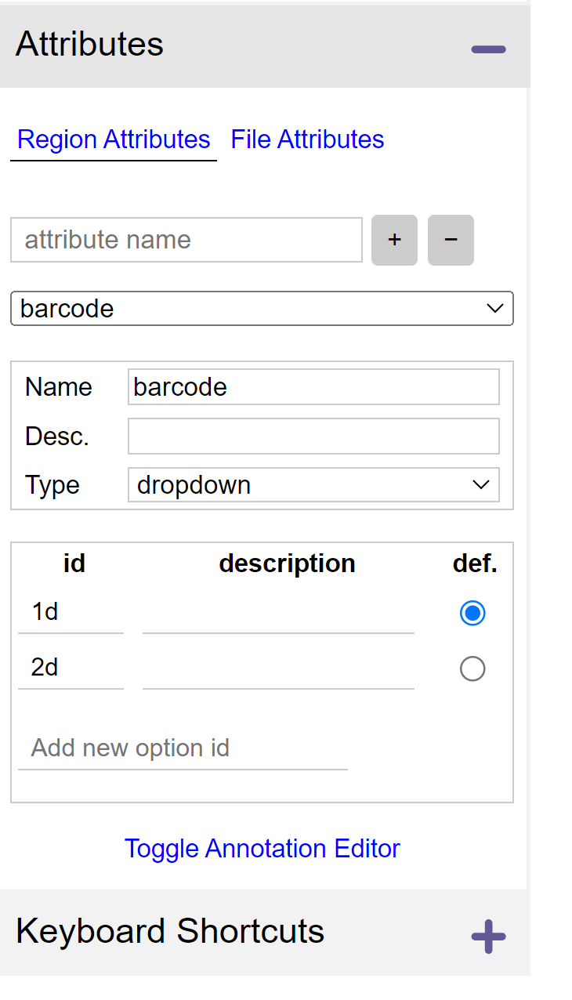
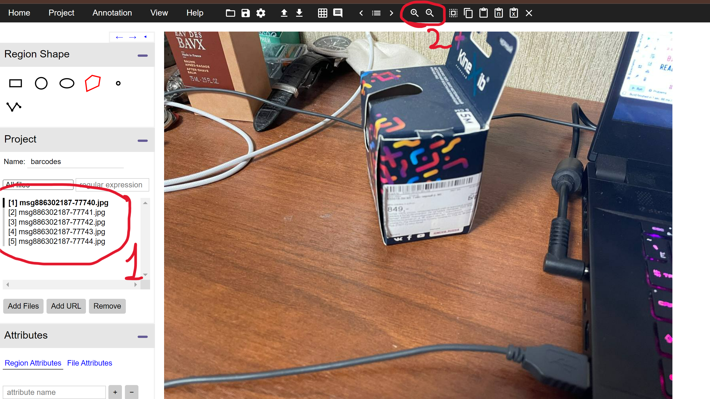
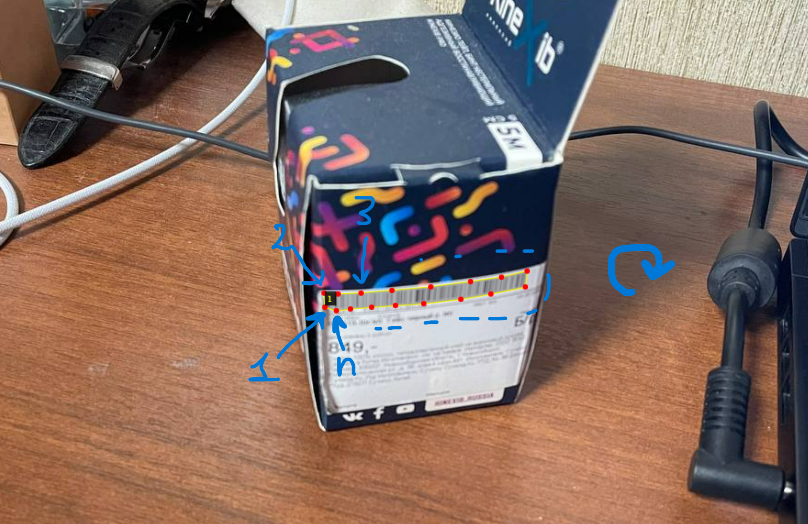
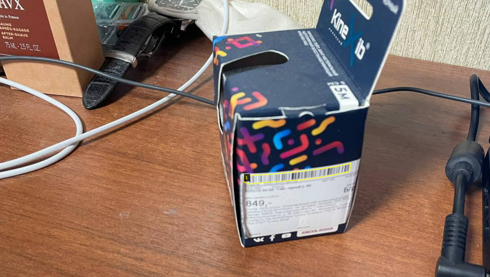
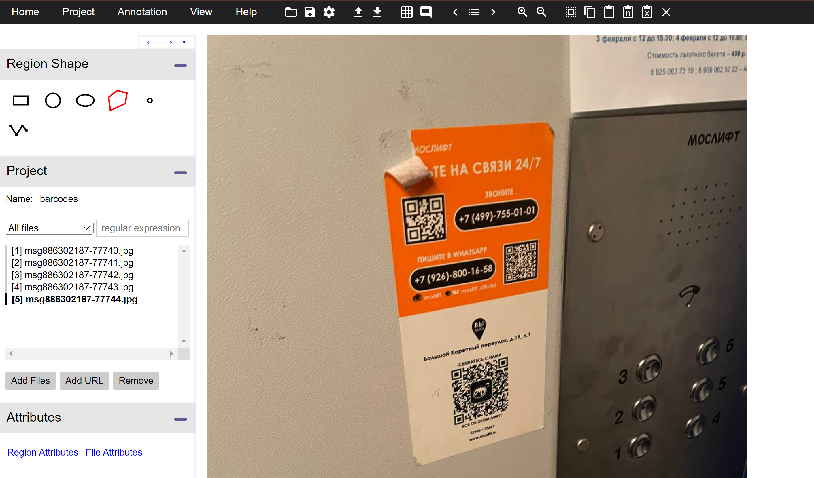
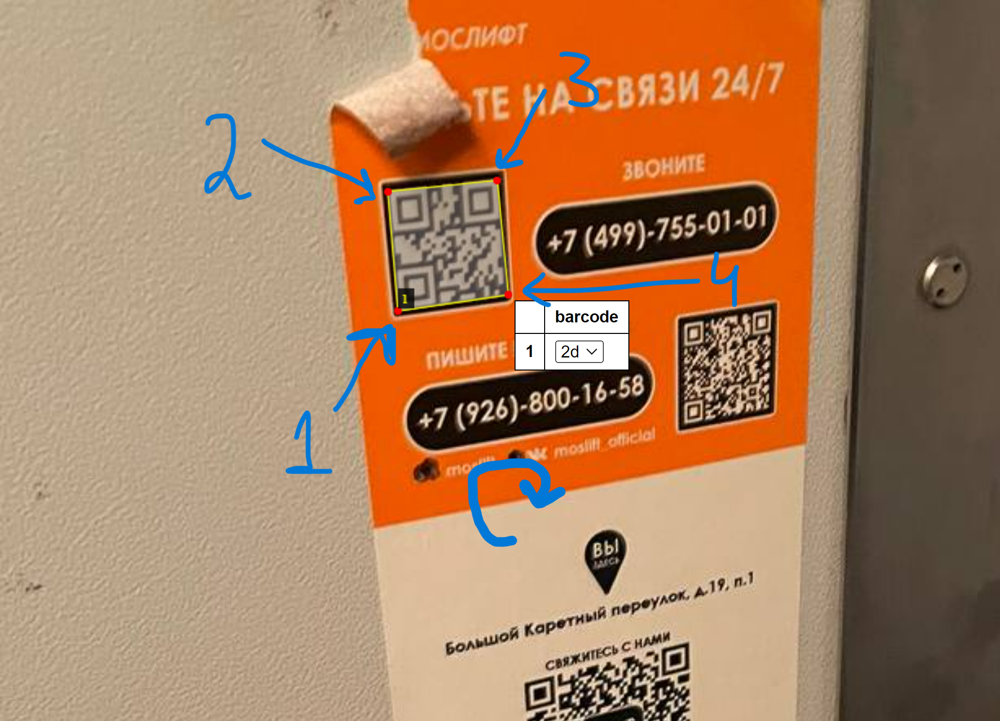
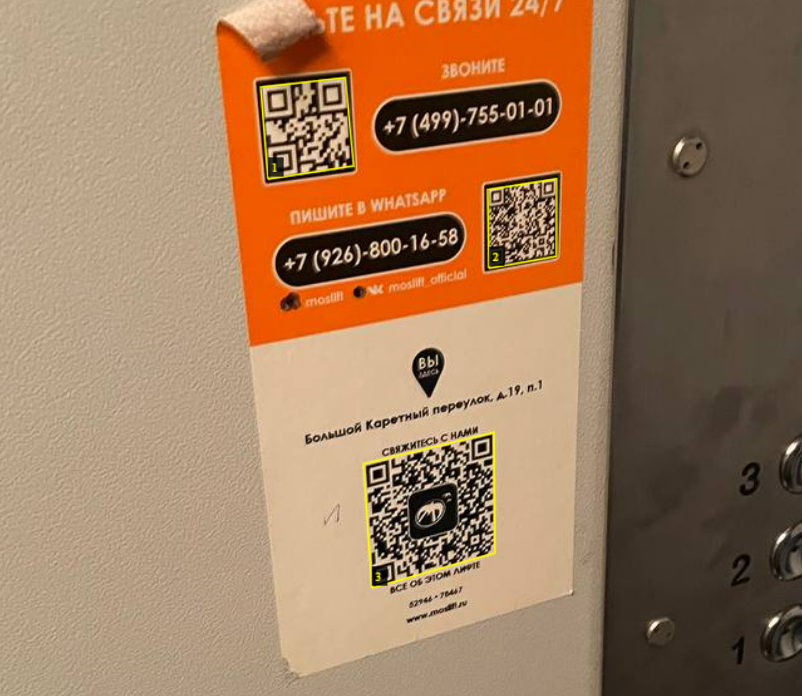
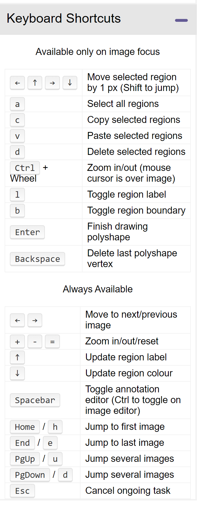

### Гайд по разметке в VGG Image Annotator (неоконченный, будет дополняться со временем).

0. В папке в которой вы сейчас находитесь лежат следующие файлы:
   a. barcodes_template.json - шаблон проекта для разметки;
   b. via.html - собственно разметчик, откройте его.
1. 
    Чтобы загрузить шаблон проекта, нажмите на Project (1), затем Load (2), в открывшемся окне выберете barcodes_template.json (3) и нажмите Открыть (4). В дальнейшем вы можете сохранять свои проекты вместе с картинками, настройками и разметкой, нажав Save (5).
2. 
   В колонке слева найдите пункт Attributes. Здесь можно описать метки для будущей разметки. В данном шаблоне (на момент написания первой версии этого гайда) есть всего 2 метки - 1d баркод (для всех штрихкодов) и 2d баркод (для всех qr-кодов). Чтобы это поле обновилось и вы увидели значения в шаблоне нажмите на File Attributes и сразу обратно на Region Attributes.
3. 
   В поле Region Shape выберите полигон (1). Вы можете поменять название проекта в поле Project Name (2). Нажмите Add Files (3) чтобы добавить картинки для разметки. В открывшемся окне выберете нужные вам картинки (можно сразу несколько) (4). Чтобы добавить их в проект нажмите Открыть (5).
4. 
   В поле Project под полем Name появится список выбранных вами файлов. Вы можете переключаться по ним в любой момент, это не удалит существующую разметку. Изучите горизонтальную полоску с инструментами сверху. Самые важные инструменты здесь - увеличение и уменьшение масштаба изображения (2).
5. 
   Чтобы начать размечать полигоны, просто нажмите в любом месте на изображении. Появится первая точка.
   ### Важно! Размечаем всегда строго по часовой стрелке. Желательно начинать размечать с левого нижнего угла баркода (если есть такая возможность).
   Если баркод искажен (например он находится на изогнутой поверхности), необходимо делать больше 4 точек. Обязательно делайте разметку точно по краю баркода! Для 1d баркода с цифрами цифры заносить в разметку не нужно! только сами штрихи ровно по краю прямоугольной области.
   После того как вы закончите ставить точки (вы увидите замкнутый полигон, который удовлетворяет всем правилам выше) нажмите Enter чтобы завершить полигон. Если вам необходимо отменить создание полигона, нажмите Esc. Для удаления последней поставленной точки нажмите Backspace.
6. 
   После того как вы сохранили полигон вы можете двигать его точки для улучшения качества разметки. Можно делать еще много чего, об этом ниже (см. пункт 11 Keyboard Shortcuts). Нажмите на любое место картинки вне полигона чтобы убрать выделение полигона.
7. 
   Снова нажмите на область внутри полигона чтобы выделить его. Теперь вы можете поменять его метку в выпадающем списке. Значение по умолчанию стоит 1d, это можно изменить в пункте Attributes (как и добавить новые значения, но делать это локально не рекомендуется).
8. 
   Выберите следующее изображение. В данном примере мы видим на изображении сразу 3 qr-кода.
   ### Важно! Если на изображении есть сразу несколько баркодов, необходимо разметить их все и проставить верные метки!
9. 
   Правила для разметки 2d баркодов такие же как и для 1d - начинаем с левого нижнего угла (если можем) и идем строго по часовой стрелке, стараясь размечать ровно по краям баркода.
10. 
11. 
   В самом низу в левой колонке есть пункт Keyboard Shortcuts. Разверните его и изучите, там есть некоторые полезные сочетания клавиш для ускорения работы.
12. 
   По завершении разметки всех картинок нажмите на Annotation (1), затем выберите Export Annotations (as json) (2) и при нажатии на этот пункт автоматически скачается json файл с разметкой.
   Если вы размечали сразу несколько картинок в одном проекте, то вся разметка будет в одном json файле. Нам же необходимо для каждой отдельной картинки иметь отдельный файл с разметкой.
